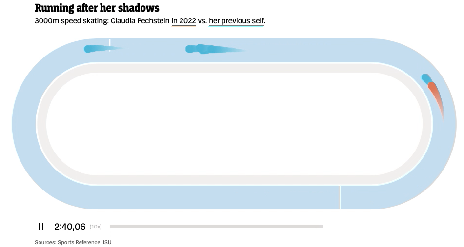

#  Speedskating

> a DER SPIEGEL Olympia widget



An animation widget to show olympic speedskating runs. Built with [Svelte](https://svelte.dev), [D3](https://d3js.org) and [regl](http://regl.party).

Watch an example video [here](https://twitter.com/h_i_g_s_c_h/status/1490722093004214281?s=20&t=FJtQAXIF6Kp0vrFUG_X4tw).


## Run locally

```
git clone https://github.com/spiegelgraphics/speedskating.git
cd speedskating
npm install
npm run dev
```

Data for the speedskating runs is imported via `config.json`. An example can be found in the `static` folder.
More (data-independent) parameters can be set in the store `params.js`.


## Examples

[Twitter video 1](https://twitter.com/h_i_g_s_c_h/status/1490722093004214281?s=20&t=FJtQAXIF6Kp0vrFUG_X4tw)

[Twitter video 2](https://twitter.com/h_i_g_s_c_h/status/1490965786986676224?s=20&t=FJtQAXIF6Kp0vrFUG_X4tw)

[Twitter video 3](https://twitter.com/h_i_g_s_c_h/status/1491828448620425220?s=20&t=FJtQAXIF6Kp0vrFUG_X4tw)

[Breaking news embedding](https://www.spiegel.de/sport/olympia/olympia-2022-claudia-pechstein-stellt-einen-rekord-ein-und-verliert-einen-anderen-a-76391c80-bc83-421c-85bf-10b8a7abc67f)

[Pechstein vs. herself (S+) article](https://www.spiegel.de/sport/wintersport/claudia-pechsteins-lauf-gegen-sich-selbst-a-7d20bc82-8494-4e16-b366-9d3484e6ddcc)


## Built by

the [DER SPIEGEL](https://www.spiegel.de) graphics department, 2022.

The application was slightly changed compared to its original to be able to run it outside of a dedicated CMS.

## License

Apache License Version 2.0